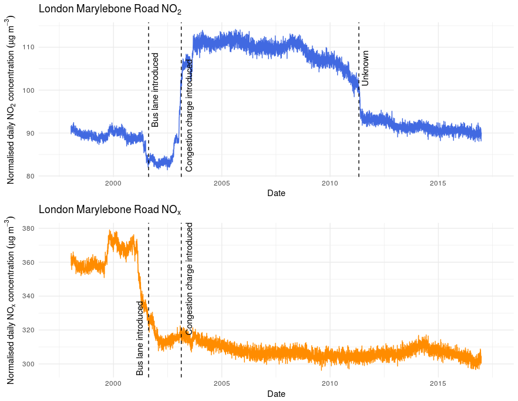

# **normalweatherr**

[](https://travis-ci.org/skgrange/normalweatherr)


## Introduction

**normalweatherr** is an R package to conduct meteorological/weather normalisation on air quality so trends and interventions can be investigated in a robust way. 

## Installation

To install the development version the [**devtools**](https://github.com/hadley/devtools) package will need to be installed first. Then:

```
# Load helper package
library(devtools)

# Install dependencies
install_github("skgrange/enlightenr")

# Install normalweatherr
install_github("skgrange/normalweatherr")
```

## Steps for usage

  1. Gain a mostly complete time-series of a numeric value with other variables which could explain variation of the numeric value. In the air quality domain, `value` will usually be a pollutant concentration and the other variables will be meteorological variables such as wind speed, wind direction, atmospheric temperature, and atmospheric pressure. However other variables could be used which might explain pollutant concentrations. The time-series will usually be at hourly or daily resolution. 

  2. A statistical model is built which uses meteorological and time variables to explain pollutant concentrations. Any statistical model which can represent interactions and non-linear relationships among the predictors could be used. But here, random forest (with [**randomForest**](https://cran.r-project.org/web/packages/randomForest/index.html)), support vector machines (with [**kernlab**](https://cran.r-project.org/web/packages/kernlab/index.html)), generalised boosted regression models (with [**gbm**](https://cran.r-project.org/web/packages/gbm/index.html)), and generalised additive models (with [**mgcv**](https://cran.r-project.org/web/packages/mgcv/index.html)) are used. 
  
  3. Evaluate performance of the statistical model. Depending on the type of model and input data, this can include:
    
    - Model performance metrics such as MSE and R<sup>2</sup>. 
    
    - Importance matrices. 
    
    - Partial dependency plots. 
    
    - Test the [bias-variance trade off](https://en.wikipedia.org/wiki/Bias%E2%80%93variance_tradeoff) by using withheld data not used in the model generation but were contained in the original set (the [training and test sets](https://en.wikipedia.org/wiki/Test_set)). 
  
  3. Randomly allocate the meteorological and time variables, but excluding the trend component used in the model to predict concentrations based on these sampled variables. When this process is repeated hundreds of times and then aggregated, the result is a prediction which represents "average" meteorology/weather.
  
  4. Continue on with appropriate trend analysis. Breakpoints, Theil-Sen estimations, etc...

## Examples

The plots below show meteorological normalised trends for NO<sub>2</sub> and NO<sub>x</sub> at London Marylebone Road between 1997 and 2016. Due to the normalisation procedure, these plots represent the *emissions* at London Marylebone Road. 



These trends are not suitable for formal trend tests because they are not monotonic, *i.e.* they are not constantly changing with time. However, the breakpoints can be explained by changes in traffic management. 

NO<sub>2</sub> shows an increase in emissions when the London congestion charge was introduced. Although this may be counter-intuitive, it can be explained by a large increase in bus traffic. Diesel buses in the early 2000s also emitted more primary NO<sub>2</sub> than passenger cars. The reason for the abrupt decrease in May 2011 is unknown to me at the moment. 

The NO<sub>x</sub> trend demonstrates that despite all the efforts gone into emission control, NO<sub>x</sub> emissions at London Marylebone Road have remained stable since the early 2000s. 

### **normalweatherr** usage example

After installation, this example can be run using prepared data from London Marylebone Road (NO<sub>2</sub>) and London Heathrow (the surface meteorological data). The `value` variable is NO<sub>2</sub> concentration in &mu;g m<sup>-3</sup>. 

```
# Load packages
library(dplyr)
library(normalweatherr)
library(openair)

# Load a prepared data frame
file <- "http://skgrange.github.io/www/data/london_marylebone_road_no2_data.rds"
data_london <- readRDS(url(file))

# Look at data
glimpse(data_london)

# Make modelling reproducible
set.seed(123)

# Prepare data, add the time variables 
data_london <- add_date_variables(data_london)

# and split into the training and testing sets
list_input_data <- split_input_data(data_london)

# What are the names of the sets? 
names(list_input_data)

# Build model
# What variables will be used?
variables <- c("wd", "ws", "air_temp", "day_julian", "date_unix", "weekday")

# Build the random forest model
model_rf <- calculate_model(
  list_input_data, 
  variables = variables, 
  mtry = 3,
  nodesize = 3,
  model = "rf"
)

# Check
names(model_rf)

# Print model things
model_rf$model
# Good performance, r2 ~80 %

# Normalise for meteorology
# Allow for parallel processing, a lot quicker
register_cores()

data_normalised <- normalise_for_meteorology(
  model_rf$model, 
  data_london, 
  variables = setdiff(variables, "date_unix"),
  n = 1000
)

# Plot normalised time series
timePlot(data_normalised, "value_predict", key = FALSE, cols = "dodgerblue")
```

## See also

  - [**deweather**](https://github.com/davidcarslaw/deweather)
